<!-- ===== Animated header ===== -->

<!-- ===== Typing line ===== -->

  

<!-- ===== Contact (replace the placeholders) ===== -->

  &nbsp;
  &nbsp;
  

---

### 👨‍💻 About me

- 🚀 I build and run my own **AI-powered SaaS products**
- 🧠 Shipped products for paying clients in **SEO / GEO analytics**, and **AI image & video generation**
- 🫧 Freelance **Bubble.io** developer
- 🤝 I work solo or with a team, and every handoff comes with documentation and a walkthrough
- 🌍 Islamabad, PK, working with clients worldwide

---

### 🛠️ Tech stack

  

Also: Hono · Drizzle ORM · Neon · Trigger.dev · Railway · Bubble.io · Claude Code

---

### 📊 GitHub stats

  
  

  

---

### 🐍 Contribution snake

  <picture>
    <source media="(prefers-color-scheme: dark)" srcset="./profile/snake-dark.svg" />
    <source media="(prefers-color-scheme: light)" srcset="./profile/snake.svg" />
    
  </picture>

<!-- ===== Animated footer ===== -->

